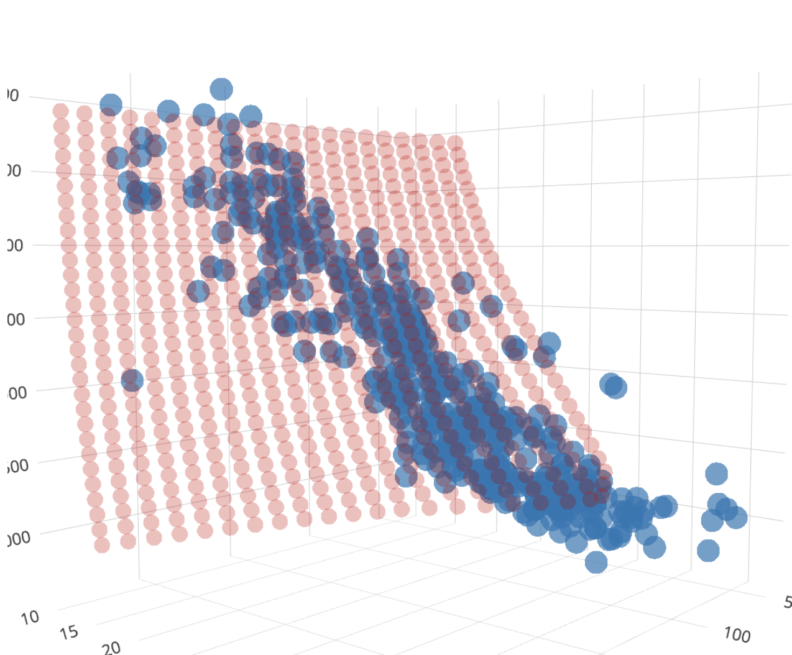

# 3D Plot

In dit voorbeeld tekenen we `horsepower`, `weight` en `mpg` in een 3D weergave. 



De demo laadt een CSV file, en een JSON file waarin al voorspellingen van een neural network staan. Dit is gedaan om dit voorbeeld kort te houden. 

De 3D plot verwacht twee arrays: de csv data, en de prediction data. 

```javascript
generate3dPlot(carData, carPredictions)
```

Deze data moet er zo uit zien:

```json
[
    {
        "horsepower": 40,
        "weight": 2000,
        "mpg": 32.06
    },
    {
        "horsepower": 40,
        "weight": 2100,
        "mpg": 32.22
    }
]
```

<br>
<br>
<br>

## ML5 predictions

Je kan de predictions zelf gaan maken met een Neural Network. De input is `horsepower` en `weight`, en je voorspelt de `mpg`. Je doet de voorspelling voor elke combinatie van horsepower en weight.

```javascript
async function createPredictions() {
    let predictions = []

    for(let hp=40; hp<250; hp+=10) {
        for (let wt = 2000; wt < 5000; wt += 100) {
            const results = await nn.predict({ horsepower: hp, weight: wt })
            const prediction = results[0].value
            predictions.push({horsepower: hp, weight: wt, mpg:prediction})
        }
    }
}
```

Als je met andere data wil werken moet je deze labels ook veranderen in de [plotly code](./libraries/scatterplot.js)

<br>
<br>
<br>

## Links

- [Plotly3D](https://plotly.com/javascript/reference/scatter3d/)
- [ML5 Neural Network](https://learn.ml5js.org/#/reference/neural-network)