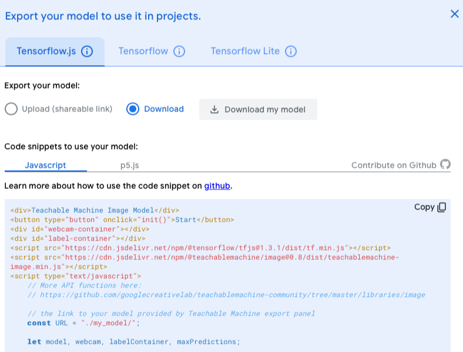

# Week 2

## College

- Introductie van het vak en van de terminologie
- Toelichting cursushandleiding
- Oefening met [Teachable Machine](https://teachablemachine.withgoogle.com). 

<br>
<br>

## Praktijk

Teachable Machine toepassen

- Train een model op [Teachable Machine](https://teachablemachine.withgoogle.com) voor het herkennen van spraak, beeld of een lichaamspose.
- Klik op **export model** en volg de instructies voor tensorflow.js. Zie screenshot.
- Test of het lokaal werkt met console berichten die de predictions tonen.
- Bedenk een eenvoudige toepassing in je HTML pagina die de gestures/sounds gebruikt als input. Bijvoorbeeld:
    - Toon emoji voor herkende gestures.
    - Gebruik [web speech](#speech) om iets te zeggen na een herkende gesture.
    - Bestuur een [game uit PRG4](https://github.com/HR-CMGT/Typescript) met gestures of spraak.
- 👉 Let op, de webcam output hoeft niet zichtbaar te zijn in de uiteindelijke HTML pagina!
- In de [Teachable Machine Documentatie](https://github.com/googlecreativelab/teachablemachine-community/tree/master/libraries/image) vind je meer code uitleg.
- ⚠️ De html embed code werkt niet helemaal goed op iOS, je moet de video tag aanpassen. [Zie deze issue](https://github.com/googlecreativelab/teachablemachine-community/issues/73).


*export window teachable machine*


<br>
<br>

## Inleveropdracht

- Meld je aan voor github classroom. De aanmeldlink krijg je van je docent.
- Clone de github classroom repository. Hierin plaats je het werk dat je wekelijks doet. Push je werk weer terug naar github classroom om het in te leveren. Schrijf altijd kort op wat je gedaan hebt in je `inleverdocument.md`.

In week 2 lever je in:
- Een bewijs dat je hebt meegedaan aan international week (kort tekstje, foto of linkje).
- De bestanden van je lokale teachable machine project.

---
<br>
<br>
<br>

### Voorbeeldcode web speech

Je kan de web speech api gebruiken om de browser te laten spreken:

```javascript
function speak() {
    let msg = new SpeechSynthesisUtterance()

    msg.text = "Well done!"

    let selectedVoice = ""
    if (selectedVoice != "") {
        msg.voice = speechSynthesis.getVoices().filter(function (voice) { return voice.name == selectedVoice; })[0]
    }

    window.speechSynthesis.speak(msg)
}
```
