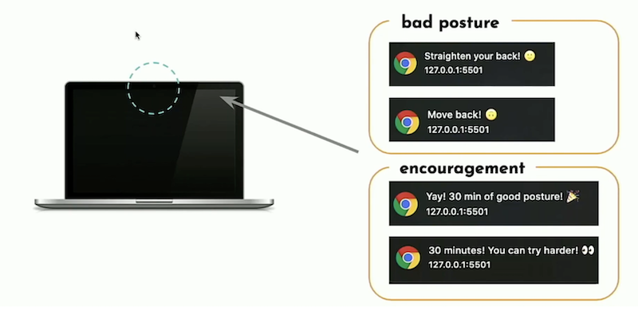

# Week 3

### College
- Introductie ML5 pre-trained models: handpose, bodypose, face, object recognition
### Praktijk en inleveropdracht
- Bouwen ML5 webcam app

<br>
<br>

# Inleveropdracht Week 3

Inleveren via github classroom: https://classroom.github.com/a/2Mfl_DnD

- Bedenk een concept voor het werken met gezichtsuitdrukking herkenning, lichaamspose herkenning, handpose herkenning, object detectie, of de image feature herkenning uit week 2.
- Lees data uit met javascript en geef feedback aan de gebruiker via de UI.
- Bouw een eenvoudige UI voor dit concept met HTML en CSS. De gebruiker hoeft dus niet in de console te kijken.

Je kan een start maken met deze voorbeeldcode:

- [ML5 Body Pose detection](https://learn.ml5js.org/#/reference/posenet)
- [ML5 Hand Pose detection](https://learn.ml5js.org/#/reference/handpose)
- [ML5 Face landmark detection](https://learn.ml5js.org/#/reference/face-api)
- [ML5 Object detection](https://learn.ml5js.org/#/reference/object-detector)
- [ML5 Feature Extractor](https://learn.ml5js.org/#/reference/feature-extractor). zie ook [Week 2](https://github.com/HR-CMGT/PRG08-2021-2022/tree/main/week2)
- [FaceApiJS Code Voorbeeld](#face)
- [HandPoseJS Code Voorbeeld](#hand)


<br>
<br>
<br>

### Voorbeelden inleveropdracht

Via FaceApi haal je data binnen over het gezicht van de gebruiker. Met `requestAnimationFrame` kijk je telkens naar de `data.leftEye()` en `data.rightEye()` data. Je kijkt wat de `x,y` posities van de ogen zijn. Als deze posities te ver uit elkaar zijn, dan zit de gebruiker te dicht met zijn snufferd over het scherm van de computer gebogen! Geef een waarschuwing via een browser notificatie. Check dit elke 5 minuten.



Of bekijk de startcode voor [schilderen met canvas](https://glitch.com/~draw-circle), of een [canvas PONG game](https://glitch.com/edit/#!/pong-game-canvas) en kijk of je dit kan besturen met de positie van je polsen.

---

<br>
<br>
<br>

## <a name="face"></a> Face API JS


De FACE API geeft een array van "landmark points" voor de belangrijkste features van je gezicht.


```javascript
// get face landmarks as array
const detections = await faceapi
        .detectAllFaces(video, new faceapi.TinyFaceDetectorOptions())
        .withFaceLandmarks();

// all positions in the first face
console.log(detections[0].landmarks.positions)        

// get specific features in the first face
const leftEye = detections[0].landmarks.getLeftEye()
const rightEye = detections[0].landmarks.getRightEye()
```

- [Het voorbeeldproject vind je in de face-api map](./face-api).
- [Face-API.JS website](https://justadudewhohacks.github.io/face-api.js/docs/index.html)

---
<br>
<br>
<br>

## <a name="hand"></a> Handpose API

De HANDPOSE API geeft een array van "landmark points" voor de vingers van je hand in 3D.


```javascript
const predictions = await model.estimateHands(video)
if (predictions.length > 0) {
    const result = predictions[0].landmarks
    // x, y, z van de top van de wijsvinger:
    let y = predictions[0].landmarks[8][0]
    let x = predictions[0].landmarks[8][1]
    let z = predictions[0].landmarks[8][2]
}
```

- [Het voorbeeldproject vind je in de handpose map](./handpose).
- [Handpose github](https://github.com/tensorflow/tfjs-models/tree/master/handpose)

---

<br>
<br>
<br>

