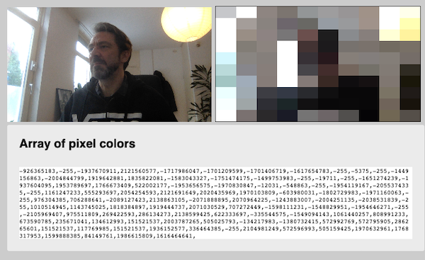
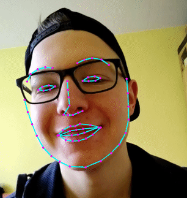
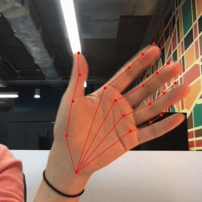

# Inleveropdracht Week 3

We gaan het K-Nearest-Neighbour algoritme gebruiken met de webcam. De webcam geeft je ***Training data*** in de vorm van pixeldata of landmarkdata.

### Code voorbeeld

```javascript
let n = new KNN(3)
n.learn(webcamdata, label)
n.learn(webcamdata, label)
n.learn(webcamdata, label)
let prediction = n.classify(webcamdata)
```
Het is de bedoeling dat je het KNN algoritme traint door telkens een ***snapshot*** van de webcam (een array van data uit een enkel webcam beeld) te associeren met een ***label***.

Dit kan je doen door een **input veld** en een **button** aan je html toe te voegen. Zodra je op de button klikt, pak je de data van het huidige webcam beeld. Hiermee train je het KNN algoritme. 

> ⚠️ Het KNN algoritme heeft voor elk label minimaal 10, maar liever meer voorbeelden nodig, om te kunnen voorspellen! Experimenteer zelf met het aantal voorbeelden.


## Inleveropdracht

- Kies een van de drie voorbeeldprojecten om webcam data uit te lezen:
   - [Pixel data uit de webcam](#pixel) (meest eenvoudig)
   - [Face expression data uit de webcam](#face)
   - [Handpose data uit de webcam](#hand)
- Bedenk een eenvoudige toepassing waarbij je deze input kan gebruiken. Bv, het herkennen van 👊, 🤚, 🖖.
- **Training** : Train het KNN algoritme met de verschillende labels. Let op dat de voorbeelden allemaal een beetje anders zijn. Dit is je training data. 
- **Predicting**: na training kan je nieuwe beelden die de webcam ziet herkennen! Gebruik dit om feedback terug te geven. Bv: toon de emoji 👊, 🤚, 🖖 voor de huidige handpose.

---
<br>
<br>
<br>

## <a name="pixel"></a> Pixel data uit de webcam

Gebruik de [webcam startcode](./webcam/) om pixel data uit de webcam te lezen. Deze pixel data wordt getoond als een array van getallen. Dit kan je rechtstreeks gebruiken om je KNN algoritme te trainen!


---
<br>
<br>
<br>

## <a name="face"></a> Face API

De FACE API geeft een array van "landmark points" voor de belangrijkste features van je gezicht.



```javascript
// get face landmarks as array
const detections = await faceapi
        .detectAllFaces(video, new faceapi.TinyFaceDetectorOptions())
        .withFaceLandmarks();

// all positions in the first face
console.log(detections[0].landmarks.positions)        

// get specific features in the first face
const leftEye = detections[0].landmarks.getLeftEye()
const rightEye = detections[0].landmarks.getRightEye()
```
[Het voorbeeldproject vind je in de face-api map](./face-api).

---
<br>
<br>
<br>

## <a name="hand"></a> Handpose API

De HANDPOSE API geeft een array van "landmark points" voor de vingers van je hand in 3D.



```javascript
const predictions = await model.estimateHands(video)
if (predictions.length > 0) {
    const result = predictions[0].landmarks
    // x, y, z van de top van de wijsvinger:
    let y = predictions[0].landmarks[8][0]
    let x = predictions[0].landmarks[8][1]
    let z = predictions[0].landmarks[8][2]
}
```

[Het voorbeeldproject vind je in de handpose map](./handpose).

---

<br>
<br>
<br>

## Extra uitdaging

Kan je je model opslaan, zodat je niet telkens opnieuw hoeft te trainen met de webcam?


---

<br>
<br>
<br>

## Voorbeeld

In dit voorbeeld is een label gemaakt met een train button. Elke keer dat je op de train button klikt wordt het algoritme getraind met de waarden. Als je op classify klikt wordt een voorspelling gedaan.


---

<br>
<br>
<br>

## Links

- [KNN week 3](./README.md)
- [Handpose API](https://github.com/tensorflow/tfjs-models/tree/master/handpose) en [tutorial](https://handsondeeplearning.com/a-quick-example-using-tensorflow-js-handpose-model/)
- [Face-api](https://github.com/justadudewhohacks/face-api.js/) 
- [Codepen KNN Demo](https://codepen.io/Qbrid/pen/OwpjLX)
- [KNear Github](https://github.com/NathanEpstein/KNear)
- [Uitleg K-Nearest-Neighbour](https://burakkanber.com/blog/machine-learning-in-js-k-nearest-neighbor-part-1/)

<br>