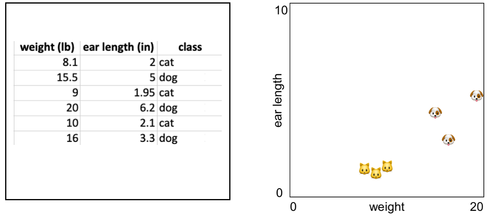

# Week 3

## Algoritmes: K-Nearest-Neighbour

Dit algoritme gebruikt afstanden tussen punten om te bepalen waar een punt bij hoort. Je leert de termen:

- **Classification** : we geven data een label, bv, "kat" of "hond"
- **Supervised Learning** : het algoritme wordt getrained met bestaande data die al labels heeft.

<br>
<br>
<br>

## K-Nearest-Neighbour

We tekenen de *weight* en *ear length* features van katten en honden in een 2D grafiek als X en Y coördinaten:

<br>



Als we een nieuw punt tekenen in de grafiek, kunnen we via de **afstand tot de andere punten** bepalen of het nieuwe punt een kat of een hond is! Dit is wat het KNN algoritme doet. Zie ook dit [interactief voorbeeld op Codepen](https://codepen.io/Qbrid/pen/OwpjLX). Meer informatie over KNN vind je in de PDF van deze week.

<br>
<br>

# Werken met KNN in Javascript

Laad het KNN algoritme, en een leeg javascript bestand:

```html
<script src="knear.js"></script>
<script src="app.js"></script>
```
Maak het algoritme aan in app.js

```javascript
const k = 3
const machine = new kNear(k)
```
Nu kan je het algoritme trainen met data uit de bovenstaande tabel. Gebruik bv. ear length, weight, height. Voeg alle data uit de tabel toe op deze manier:
```javascript
machine.learn([6.2, 20, 9], 'cat')
```

## Classifying

Nu kunnen we nieuwe data classificeren! Bedenk zelf de eigenschappen van een dier (ear length, weight, height) en vraag wat voor dier dit is:

```javascript
let prediction = machine.classify([7,18,7])
console.log(`I think this is a ${prediction}`)
```
<br>
<br>

# Les oefening week 3

### Cat or dog?

| Body length | Height | Weight | Ear length |  Label |
| ----------- | ------ | ------ | ---------- |  ----- |
| 18 | 9.2 | 8.1 | 2 | 'cat' |
| 20.1 | 17 | 15.5 | 5 | 'dog' |
| 17 | 9.1 | 9 | 1.95 | 'cat' |
| 23.5 | 20 | 20 | 6.2 | 'dog' |
| 16 | 9.0 | 10 | 2.1 | 'cat' |
| 21 | 16.7 | 16 | 3.3 | 'dog' |

Gebruik bovenstaande javascript uitleg, de data in de tabel, en de [startcode](./knear) om een KNN algoritme te trainen. Test of het werkt door nieuwe data in te voeren en te voorspellen of dit een kat of een hond is.

Kan je andere data vinden om je KNN algoritme mee te trainen?

- [Starter files met KNear algoritme](./knear)

<br>
<br>

# Inleveropdracht week 3

Bij de inleveropdracht van week 3 ga je KNN gebruiken om de input van een webcam te classificeren.

[Ga naar de inleveropdracht](./inleveropdracht.md)

<br>
<br>

## Externe links

- [Codepen Demo](https://codepen.io/Qbrid/pen/OwpjLX)
- [KNear Github](https://github.com/NathanEpstein/KNear)
- [Uitleg K-Nearest-Neighbour](https://burakkanber.com/blog/machine-learning-in-js-k-nearest-neighbor-part-1/)
