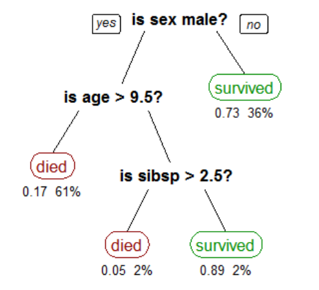

# Week 4

## Algoritmes: Decision Tree

Dit algoritme bouwt een hiërarchische boomstructuur om te bepalen wat het belangrijkst is in een dataset. 

- **Classification** : we geven data een label, bv, "survived" of "died"
- **Supervised Learning** : het algoritme wordt getrained met bestaande data die al labels heeft.

In deze Decision Tree zien we de kans dat een passagier zijn vakantie op de Titanic overleeft. Het algoritme genereert deze tree op basis van training data.

<br>



<br>
<br>

# Opdracht

In deze voorbeeldcode werken we met het `decisiontree` algoritme en een `tree visualiser` waarmee de tree getekend kan worden. We gebruiken de `papa parse` library om CSV bestanden in te laden.

<br>
<br>

## Data laden

Gebruik Papa Parse om een van de datasets te laden. 

```javascript
function loadData(){
    Papa.parse("data/simpsons.csv", {
        download:true,
        header:true, 
        dynamicTyping:true,
        complete: results => console.log(results.data)
    })
}
```

<br>
<br>
<br>

## Training

In de CSV moet je controleren wat de **naam is van het label**. In het geval van de Simpsons data (waarbij we gaan kijken of een Simpsons karakter een man of een vrouw is), is het label **"Gender"**. 

Het algoritme geeft ook de mogelijkheid om kolommen te negeren. In het geval van de simpsons data is de `Name` kolom niet behulpzaam bij de voorspelling.

```javascript
let ignoredColumns = ['Name']
let label = "Gender"

function trainModel(data) {
    let decisionTree = new DecisionTree({
        ignoredAttributes: ignoredColumns,
        trainingSet: data,
        categoryAttr: label
    })
}
```

<br>
<br>
<br>

## Boomstructuur visualiseren 🌳 

Je kan visualiseren hoe de tree er uit ziet! Dat doe je door de tree structuur op te vragen als JSON. Die JSON kan je doorgeven aan de [visualiser](https://vega.github.io/vega/examples/tree-layout/). 

Je geeft ook een DOM element mee, en de breedte en hoogte.

```javascript
let json = decisionTree.toJSON()
let visual = new VegaTree('#view', 2300, 1000, json)
```

<br>
<br>
<br>

## Prediction

Nu kunnen we nieuwe data classificeren! Bedenk zelf fictieve eigenschappen en kijk wat het algoritme erover zegt:

```javascript
let person = {Name:"Bob", Hairlength:0.1, Weight:77, Age:33}
let prediction = decisionTree.predict(person)
console.log(`${person.Name}'s gender is ${prediction}`)
```
<br>
<br>
<br>

## Grotere datasets

We gaan dit nu uitproberen met *real world data*. Deze kan je vinden in de `data` map.

- Poisonous mushrooms: voorspel of een paddestoel giftig is of niet
- Diabetes: voorspel of iemand diabetes gaat krijgen
- Titanic: voorspel of iemand zijn vakantie op de titanic gaat overleven

Let hierbij op de **naam van het label** in de CSV file, en of er kolommen zijn die je wil negeren. Kijk ook naar de betekenis van de labels. Bijvoorbeeld: bij de paddestoelen betekent "P" poisonous en "E" edible.

```javascript
// mushroom data
let ignoredColumns = []
let label = "class"

let decisionTree = new DecisionTree({
    ignoredAttributes: ignoredColumns,
    trainingSet: data,
    categoryAttr: label     
})
```


<br>
<br>
<br>
<br>

# Inleveropdracht week 4

Bij de inleveropdracht van week 4 ga je een van deze datasets gebruiken, en je gaat testen hoe accuraat je voorspellingen zijn.

[Ga naar de inleveropdracht](./inleveropdracht.md)

<br>
<br>

## Externe links

- [Decision Tree Javascript](https://github.com/lagodiuk/decision-tree-js)
- [Vega tree hierarchy viewer](https://vega.github.io/vega/examples/tree-layout/)
- [Towards Data Science : Decision Tree explanation](https://towardsdatascience.com/decision-trees-in-machine-learning-641b9c4e8052/)
