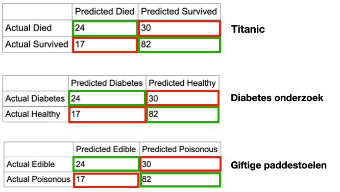

# Inleveropdracht week 4

Bij de inleveropdracht van week 4 ga je een echte dataset gebruiken, én testen hoe accuraat je voorspellingen zijn. 

## Inleveren:

- Project waarin: 
  - Je een van de drie CSV datasets (*diabetes, mushrooms, titanic*) uit dit project hebt ingeladen.
  - De dataset als decision tree getekend wordt.
  - Je hebt de accuracy uitgerekend. 
  - Je hebt een extra uitdaging gekozen en deze geprobeerd uit te werken.
- Ingevuld inleverdocument 
  - Welke data heb je gebruikt? 
  - Wat is je accuracy? Hoe zou dat nog beter kunnen?
  - Hoe ver ben je gekomen met de extra uitdagingen?


<br>
<br>
<br>

## Data

Gebruik een van deze datasets. Deze staan al in de `data` folder! Je kan op de Kaggle link klikken om er wat meer over te lezen.

- Voorspel of je het eten van een paddestoel gaat overleven
<br> [**Poisonous mushrooms dataset**](https://www.kaggle.com/uciml/mushroom-classification)
- Voorspel of je huidige levensstijl diabetes gaat opleveren <br>[**Diabetes dataset**](https://www.kaggle.com/uciml/pima-indians-diabetes-database)
- Voorspel of iemand zijn vakantie op de Titanic gaat overleven
<br> [**Titanic dataset**](https://www.kaggle.com/c/titanic). Let op, deze tabel heeft veel kolommen die je weg kan laten.


<br>
<br>
<br>

## Traindata en testdata

Bij het inlezen van de data moet je controleren wat het **label** is waarop we willen trainen. Ook moet je even kijken of er kolommen zijn die niet relevant zijn bij het trainen.

- Bij 'mushrooms.csv' is het label "class", en de inhoud is "p" (poisonous) en "e" (edible.)
- Bij 'diabetes.csv' is het label "Label" en de inhoud is "1" (diabetes) en "0" (geen diabetes)
- Bij 'titanic.csv' is het label "Survived" en de inhoud is "1" (survived) en "0" (not survived). Ook heeft de titanic dataset veel kolommen die misschien niet relevant zijn: "Name", "Cabin", "PassengerId", "Ticket", "Fare". Je kan kijken of je algoritme beter wordt als de deze kolommen negeert.


We gaan de data opsplitsen in trainingdata en testdata om te kunnen uitrekenen hoe goed het algoritme werkt. Sommige Kaggle sets zijn al opgesplitst. Als dat niet zo is kan je het zelf doen met javascript. 

```javascript
let trainData = data.slice(0, Math.floor(data.length * 0.8))
let testData = data.slice(Math.floor(data.length * 0.8) + 1)
```
Nu kan je de decision tree genereren en tekenen.
```javascript
let decisionTree = new DecisionTree({
    // hier kan je aangeven welke kolommen genegeerd moeten worden
    ignoredAttributes: ['Name'],    
    trainingSet: trainData,
    // dit is het label dat je wil gaan voorspellen
    categoryAttr: "survived"          
})
// teken de tree met D3
let json = decisionTree.toJSON()
let visual = new VegaTree('#view', 2300, 1000, json)
```
> Let op, als je CSV file toevallig is gesorteerd op label, dan heeft je traindata alle positieve labels, en je testdata alle negatieve labels. Dat is natuurlijk niet handig. Om dit te voorkomen kan je je array shufflen **voordat** je splitst op traindata en testdata.

```javascript
arr.sort(() => (Math.random() - 0.5)
```

<br>
<br>
<br>

## Prediction

Uiteindelijk kunnen we voorspellingen gaan doen. Gebruik hiervoor een item uit de testdata.

```javascript
let passenger = testData[0]
let passengerPrediction = decisionTree.predict(passenger)
console.log(`Survived the holiday : ${passengerPrediction}`)
```

<br>
<Br>
<br>

## Accuracy

Als we de testdata gebruiken voor onze voorspellingen, dan kunnen we aan het label van de testdata zien of de voorspelling goed was of niet!

Als we weten dat 70 van de 100 voorspellingen goed gedaan zijn, dan zeggen we dat ons algoritme een **Accuracy van 70%** heeft.

<br>

> ⚠️ Let op! Bij een prediction moet je nooit het correcte label meegeven. Die moet je dus eerst verwijderen uit je test sample. In dit voorbeeld maken we eerst een kopie van de titanic testdata en daaruit verwijderen we het "survived" label.

```javascript
function testPassenger(passenger) {
    // kopie van passenger maken, zonder het label
    const passengerWithoutLabel = Object.assign({}, passenger)
    delete passengerWithoutLabel.survived

    // prediction
    let prediction = decisionTree.predict(passengerWithoutLabel)

    // vergelijk de prediction met het echte label
    if (prediction == passenger.survived) {
        console.log("Deze voorspelling is goed gegaan!")
    }
}

testPassenger(testData[0])
```
Schrijf nu een `for` loop waarin je alle rijen uit de testdata test! Je kan nu bijhouden hoeveel van jouw predictions overeenkomen met de werkelijkheid. Dit geeft uiteindelijk je accuracy:

```javascript
let accuracy = amountCorrect / totalAmount
```

Toon in de HTML wat de accuracy is van jouw decision tree.

<br>
<br>
<br>


# Extra uitdaging

Kies één (of meer) van deze drie extra uitdagingen om meer te leren over het werken met Machine Learning.

1. Data van Kaggle gebruiken
2. Model opslaan als JSON
3. Confusion Matrix tekenen

<br>
<br>
<br>

## 1 - Data van Kaggle gebruiken

[Browse naar een dataset op Kaggle](https://www.kaggle.com). Let hierbij op dat je zoekt naar data die geschikt is voor **classification**. Dat betekent dat de data een **label** moet hebben. Bijvoorbeeld : *giftig/niet giftig* of *kat/hond/hamster*. Teken een decision tree voor deze data.

<br>
<br>
<br>

## 2 - Model opslaan als JSON

Als je het model hebt gemaakt (de Decision Tree), dan heb je de originele data niet meer nodig. Je kan de decision tree als JSON opvragen:

```javascript
let decisionTree = new DecisionTree({...})

// de tree kan je opvragen als JSON
let json = decisionTree.toJSON()
let jsonString = JSON.stringify(json)
console.log(jsonString)
```

🔥  Sla deze JSON op in een apart bestand (Bv. met copy>paste vanuit de console), en gebruik [fetch](https://developer.mozilla.org/en-US/docs/Web/API/Fetch_API) om dit weer in te laden. Nu kan je je decision tree gebruiken zonder dat je het originele CSV bestand nog nodig hebt!

<br>
<br>
<br>

## 3 - Confusion Matrix

Met een ***Confusion Matrix*** krijg je nog wat meer inzicht in je accuracy. Je gaat nu ook bijhouden waarom een voorspelling goed of fout was. Bijvoorbeeld bij de mushrooms:

```javascript
if(prediction == "e" && label == "p") {
    console.log("🍄 predicted edible, but was actually poisonous!🤮 ⚰️")
}
if(prediction == "p" && label == "e") {
    console.log("🍄 predicted poisonous, but was actually edible! 😬")
}
```



Kan je jouw confusion matrix in de HTML file tonen?

```html
<div>
    <h4>Confusion Matrix</h4>
    <table id="confusion">
        <tr>
            <td></td>
            <td>Predicted true</td>
            <td>Predicted false</td>
        </tr>
        <tr>
            <td>Actually true</td>
            <td> - </td>
            <td> - </td>
        </tr>
        <tr>
            <td>Actually false</td>
            <td> - </td>
            <td> - </td>
        </tr>`
    </table>
</div>
```

<br>
<br>

## Externe links

- [Kaggle datasets](https://www.kaggle.com/datasets)
- [Decision Tree Javascript](https://github.com/lagodiuk/decision-tree-js)
- [Vega tree hierarchy viewer](https://vega.github.io/vega/examples/tree-layout/)
- [Papa Parse](https://www.papaparse.com)
- [Towards Data Science : Decision Tree explanation](https://towardsdatascience.com/decision-trees-in-machine-learning-641b9c4e8052/)
