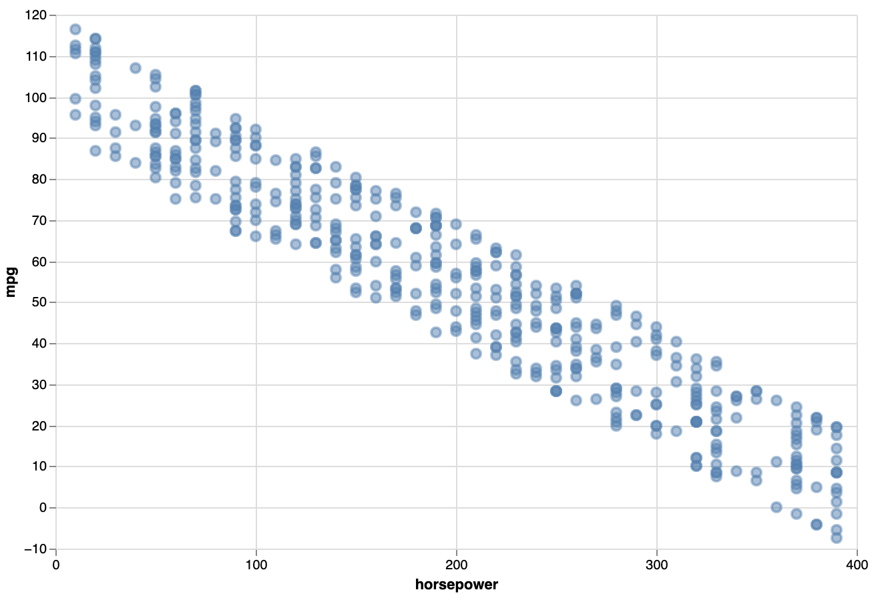
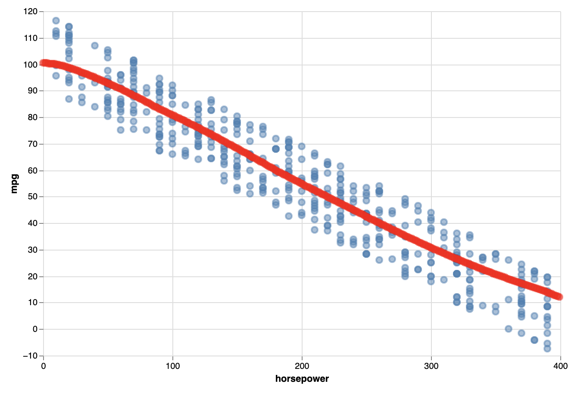

# Week 5

## Algoritmes: Neural Networks


Een neural network is in staat om complexe patronen in data te vinden. Je kan een neural network gebruiken voor:

- **Classification** : het algoritme voorspelt een label, bv: "survived" of "died"
- **Regression** : het algoritme voorspelt een getal, bv: "temperatuur", "prijs", "luchtvervuiling"

In deze oefening werken we met regression. Ook gaan we kijken hoe we data kunnen tekenen in een grafiek. We gaan de voorspelling ook tekenen!

<br>
<br>
<br>

# ML5

[ML5](https://ml5js.org) is een gebruiksvriendelijke library om snel met Machine Learning en Neural Networks aan de slag te kunnen. De onderliggende techniek is [TensorFlowJS](https://www.tensorflow.org/js/).

### Fake data

In de startcode van deze oefening werken we met fake data. Dit zijn een aantal random punten met een "horsepower" en "mpg" waarde. Dit gebruiken we om te leren hoe de scatterplot werkt en hoe we eenvouding een neural network kunnen trainen.

```javascript
let fakeData = createFakeData()

// result:
[
    { horsepower: 220, mpg: 30 }, { horsepower: 300, mpg: 20 }, ...
]
```

<br>
<br>
<br>

## 🔥 Neural Network

In ML5 maak je als volgt een Neural Network voor regression:

```javascript
const options = { task: 'regression', debug: true }
const nn = ml5.neuralNetwork(options)
```
In de afbeelding hierboven zie je dat een neural network *hidden layers* heeft. ML5 maakt deze automatisch voor je aan. 

<br>
<br>
<br>
<br>

## Training

Nu kan je data gaan toevoegen met de `addData` functie. 

> ⚠️ Trainingdata in een neural network voor regression bestaat altijd uit getallen!

Let op dat je eerst de data shuffled, om te voorkomen dat er een patroon herkend wordt in de volgorde van je data. We gebruiken de `horsepower` van de auto om te voorspellen wat de `mpg` gaat zijn.

```javascript
// shuffle
fakeData.sort(() => (Math.random() - 0.5))

// een voor een de training data toevoegen aan het neural network
for (let car of fakeData) {
    nn.addData({ horsepower: car.horsepower }, { mpg: car.mpg })
}
```
Je moet de data normaliseren, en dan kan je gaan trainen. Bij het trainen moet je aangeven hoeveel `epochs` dit moet duren. Hier kan je zelf mee experimenteren.

```javascript
nn.normalizeData()
nn.train({ epochs: 10 }, () => finishedTraining()) 

function finishedTraining(){
    console.log("Finished training!")
}
```
<br>
<br>
<br>

## Prediction

Met de `predict` functie kunnen we nieuwe data voorspellen! Dit kan je makkelijk testen met een fake auto:

```javascript
async function finishedTraining() {
    let testCar = { horsepower: 90 }

    const results = await nn.predict(testCar)
    console.log(results)

    const prediction = results[0].value
    console.log(`Deze auto zal een verbruik hebben van: ${prediction}`)
}
```

<br>
<br>
<br>
<br>


# Scatterplot

Je kan meteen na het inladen van je data (voor het trainen) al een scatterplot tekenen. Hieraan kan je zien hoe de `mpg` zich verhoudt tot de `horsepower`.




Omdat onze data er zo uit ziet: `{ horsepower: 220, mpg: 30 }` geven we onderstaande arguments mee aan de scatterplot. 

```javascript
import { VegaScatterplot } from "./libraries/vegascatterplot.js"

async function createScatterplot(data) {
    let plot = new VegaScatterplot()

    // x-axis, y-axis, width, height, data (array of objects)
    await plot.initialise("horsepower", "mpg", 600, 400, data)

    // do the next step
    // ...
}
```

<br>
<br>
<br>

## Prediction tekenen als lijn

Als we nu voor elke mogelijke `horsepower` (waarden van 0 tot 400) een prediction doen, dan krijgen we een array van punten. Deze kunnen we tekenen in de scatterplot. Dit illustreert of het neural network de complexiteit in de data kan herkennen.



In de vega scatterplot moet je nieuwe data in één keer als array doorgeven. Je moet dus eerst alle predictions doen en die tijdelijk in een array zetten.


```javascript
async function drawPredictions() {
    // tijdelijke array om predictions in op te slaan
    let predictions = []

    // horsepower gaat van 0 tot 400
    for(let hp=0; hp<400; hp++) {

        // prediction voor waarde hp
        const results = ...

        // object opslaan voor scatterplot: { horsepower: 3, mpg: 10 }
        predictions.push(...)
    }

    // teken predictions in scatterplot
    await plot.addPoints(predictions)
}
```
<br>
<br>
<br>

## ⚠️ Async await

> Let op het gebruik van `async await`. Zodra je ergens `await` nodig hebt, moet je zorgen dat dit binnen een `async` functie staat!

```javascript
async function doSomething() {
    let result = await doComplicatedThing()
    console.log("ready!")
}
```

<br>
<br>
<br>
<br>

# Inleveropdracht week 5

Bij de inleveropdracht van week 5 ga je deze oefening af maken, en dan een echte dataset toevoegen. Ook ga je het model opslaan zodat je niet telkens opnieuw hoeft te trainen.

[Ga naar de inleveropdracht](./inleveropdracht.md)

<br>
<br>
<br>


## Datasets voor regression

- [Beijing Pollution, Salary Prediction](https://www.kaggle.com/ahmettezcantekin/beginner-dataset-v2)
- [Boston House Prices](https://www.kaggle.com/vikrishnan/boston-house-prices)
- [Cars miles per gallon](https://www.kaggle.com/uciml/autompg-dataset)
- [Kaggle regression dataset search](https://www.kaggle.com/search?q=tag%3A%22regression%22+in%3Adatasets)

## Documentation

- [🔥 ML5 Neural Networks in Javascript](https://learn.ml5js.org/#/reference/neural-network)
- [Vega Scatterplot documentation](https://vega.github.io/vega/examples/scatter-plot/)


## Externe links

- [📺 Crash Course Neural Networks](https://www.youtube.com/watch?v=JBlm4wnjNMY)
- [📺  But what is a neural network?](https://www.youtube.com/watch?v=aircAruvnKk)
- [📺  Showcase: Made with TensorFlowJS](https://www.youtube.com/watch?v=GskMuu821NI)
- [📺 Code a perceptron from scratch in javascript!](https://www.youtube.com/watch?v=o98qlvrcqiU&t=26s)
- [Neural Network Playground](https://playground.tensorflow.org/)
- [Towards Data Science : Neural Networks for beginners](https://towardsdatascience.com/a-beginners-guide-to-neural-networks-d5cf7e369a13)
