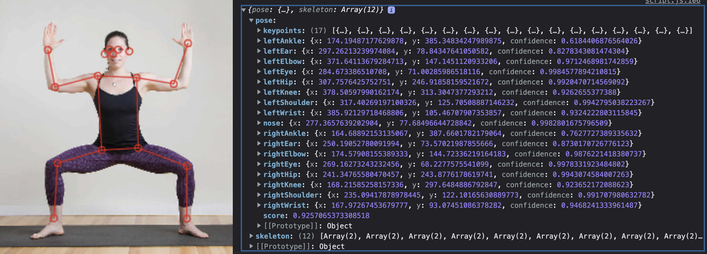
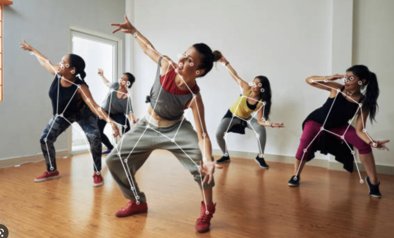

# Inleveropdracht Week 5

In week 4 hebben we gewerkt met posemodels. Deze geven gedetailleerde data over de positie van je lichaam, hand, of gezicht. Het is echter nog best lastig om precies te kunnen zeggen wat voor houding iemand aanneemt.

Daarom gaan we de posedata gebruiken als ***training data voor het KNN algoritme***. Hiermee kunnen we de coördinaten van iemand's pose ook echt gaan herkennen.

> ⚠️ Zorg dat je de [lesoefening met "cats and dogs"](./README.md) onder de knie hebt voordat je aan de pose opdracht begint.

<br>
<br>
<br>

*Inleveropdracht. Maak elke stap af voordat je aan de volgende begint*:

  1. Kies een pose model: ***(handpose, bodypose, facepose)*** en bedenk een eenvoudige toepassing.
  2. Lees de pose data uit in de console. Dit verschilt afhankelijk van het pose model! Kijk hoe je de data kan omzetten naar een array van numbers.
  3. Maak een button in de html die `KNN.learn()` kan aanroepen met deze numbers. Train met verschillende labels en voorbeelden.
  4. Voorspel nieuwe poses.

<br>
<br>
<br>

## 1 - Kies een pose model

- [Facepose](#face)
- [Handpose](#hand)
- [Bodypose](#body)

Bedenk hier een toepassing voor, bijvoorbeeld:
- Speel Rock, Paper, Scissors waarbij je altijd verliest van de computer
- Herken een aantal yoga poses
- Gezichtsuitdrukkingen herkennen en een bijpassend muziekje afspelen 😭 

<br>
<br>
<br>


## 2 - Posedata uitlezen

Zoals je in de oefening met cats/dogs gezien hebt verwacht het KNN algoritme een array van numbers, om iets te kunnen leren:

```javascript
knn.learn([4,5,3,3],"cat")
```
De data die je terugkrijgt uit een pose detection is helaas niet altijd een simpele array van numbers:



We moeten deze data versimpelen voordat we het aan `knn.learn()` kunnen doorgeven.

```javascript
let keypoints = [
    {score: 0.08611194044351578, part: "nose", position: {x: 395.12493920233464, y: 186.4516202577821}},
    {score: 0.1300605982542038, part: "leftEye", position: {x: 400.92967230058366, y: 188.31491670719845}},
    {score: 0.08765200525522232, part: "rightEye", position: {x: 415.5980590345331, y: 172.98907921935796}},
    //...etc
]
```

Je kan een `for` loop schrijven om alleen de `x` en `y` data uit de bodypose data te halen:

```javascript
let pose = []
for(let point of keypoints){
	pose.push(point.position.x)
    pose.push(point.position.y)
}
```
Het resultaat is een array waarin alleen `x` en `y` voorkomen. Dit is geschikt om te gebruiken als training data voor KNN:

```javascript
[395.12493920233464, 186.4516202577821, 400.92967230058366, 188.31491670719845, 415.5980590345331, 172.98907921935796]
```

<br>
<br>
<br>

## 3 - KNN trainen met een button

Het is de bedoeling dat je het KNN algoritme traint door telkens een ***snapshot*** van de webcam (een array van data uit een enkel webcam beeld) te associeren met een ***label***.

Dit kan je doen door een **button** aan je html toe te voegen. Zodra je op de button klikt, maak je een array van de huidige posedata. Hiermee roep je `knn.learn()` aan met een label. Je zou bijvoorbeeld een button kunnen maken voor elke pose die je wilt herkennen.

```javascript
function capturePose(){
    // gebruik de webcam om de posedata uit te lezen
    let pose = ... 
    // leer knn dat dit een "standing" pose is
    knn.learn(pose, "standing")
}
// maak een "Standing" button
standButton.addEventListener("click", () => capturePose())
```

> ⚠️ Het KNN algoritme heeft voor elk label minimaal 10, maar liever meer voorbeelden nodig, om te kunnen voorspellen! Experimenteer zelf met het aantal voorbeelden.

<br>
<br>
<br>

## 4 - Voorspellen

Nadat je voldoende voorbeelden hebt gegeven kan je nieuwe poses classificeren

```javascript
let pose = [3,45,52,2,11,...] // live uit webcam
let prediction = knn.classify(pose)
console.log(prediction) // "standing"
```

<br>
<br>
<br>

## Voorbeeld UI

In deze UI zie je dat er een button en een inputveld wordt gebruikt om `rock, paper, scissors` poses te leren. De `classify` button voorspelt de huidige pose.


---
<br>
<br>
<br>
<br>
<br>
<br>

# <a name="face"></a> Face API

De FACE API geeft een array van "landmark points" voor de belangrijkste features van je gezicht.


```javascript
// get face landmarks as array
const detections = await faceapi
        .detectAllFaces(video, new faceapi.TinyFaceDetectorOptions())
        .withFaceLandmarks();

// all positions in the first face
console.log(detections[0].landmarks.positions)        

// get specific features in the first face
const leftEye = detections[0].landmarks.getLeftEye()
const rightEye = detections[0].landmarks.getRightEye()
```
[Het voorbeeldproject vind je in de face-api map](./face-api).

---
<br>
<br>
<br>

# <a name="hand"></a> Handpose API

De HANDPOSE API geeft een array van "landmark points" voor de vingers van je hand in 3D.


```javascript
const predictions = await model.estimateHands(video)
if (predictions.length > 0) {
    const result = predictions[0].landmarks
    // x, y, z van de top van de wijsvinger:
    let y = predictions[0].landmarks[8][0]
    let x = predictions[0].landmarks[8][1]
    let z = predictions[0].landmarks[8][2]
}
```

[Het voorbeeldproject vind je in de handpose map](./handpose).

<br>
<br>
<br>

# <a name="body"></a> BodyPose API

De BodyPose API geeft een array met alle indivuele onderdelen van je lichaam. 



```javascript
const video = document.getElementById('video')
const poseNet = ml5.poseNet(video, modelLoaded)
let poses = []

function modelLoaded() {
    console.log('Model Loaded!')
}

poseNet.on('pose', (results) => {
  poses = results
  console.log(poses)
})
```
De poses zullen als volgt in de console verschijnen. Als er meerdere personen in beeld zijn kunnen er meer poses in de array staan. Je kan de `keypoints` property gebruiken om alle `x` en `y` waardes van het hele lichaam uit te lezen. Dit kan je gebruiken als input voor `knn.learn()`.

```javascript
[
  {
    pose: {
      keypoints: [{ position: { x, y }, score, part }, ...],
      leftAnkle: { x, y, confidence },
      leftEar: { x, y, confidence },
      leftElbow: { x, y, confidence },
      ...
    },
  },
]

```


[De documentatie vind je op ML5.org](https://learn.ml5js.org/#/reference/posenet?id=posenet)

---

<br>
<br>
<br>

## Links

- [KNN](./README.md)
- [Handpose API](https://github.com/tensorflow/tfjs-models/tree/master/handpose) en [tutorial](https://handsondeeplearning.com/a-quick-example-using-tensorflow-js-handpose-model/)
- [Face-api](https://github.com/justadudewhohacks/face-api.js/) 
- [ML5 BodyPose](https://learn.ml5js.org/#/reference/posenet?id=posenet)
- [Codepen KNN Demo](https://codepen.io/Qbrid/pen/OwpjLX)
- [KNear Github](https://github.com/NathanEpstein/KNear)
- [Uitleg K-Nearest-Neighbour](https://burakkanber.com/blog/machine-learning-in-js-k-nearest-neighbor-part-1/)

<br>
