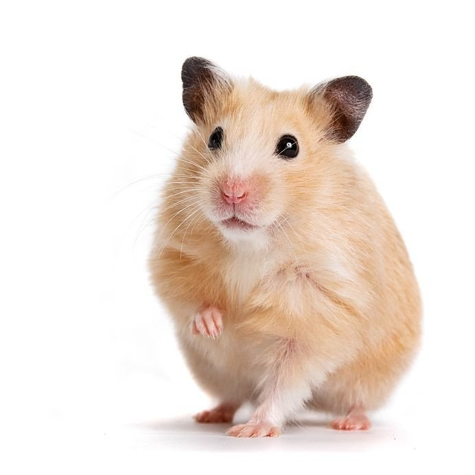

# Inleveropdracht week 6

### Lezen:

 - [Lees de ML5 documentatie over de Image Classifier](https://learn.ml5js.org/#/reference/image-classifier)

### Inleveren:

- De uitgewerkte ImageClassifier opdracht
- Ingevuld inleverdocument
   - Wat kan de classifier wel en niet herkennen?
   - Is het gelukt om er een game UI omheen te bouwen?

 
 
 
 

# Opdracht

## ImageClassifier

Maak een ImageClassifier aan met hulp van de [documentatie]((https://learn.ml5js.org/#/reference/image-classifier)). Let hierbij op de volgorde van je functies! Je kan pas voorspellen als het model helemaal is ingeladen!

## Image voorspellen

Voorspel wat er op de afbeelding in de `` tag staat. Probeer dit met meerdere afbeeldingen. Wat wordt er wel en niet herkend in het pre-trained model?

## Voorspelling uitspreken

Gebruik [Browser Speech](https://github.com/HR-CMGT/PRG08-2020-2021/blob/main/snippets/speech.md) om te zeggen wat de afbeelding is. Kan je er ook bij zeggen hoe accuraat de voorspelling is? Of wat de tweede keus is?

## Game UI

Vraag aan de gebruiker om een bepaalde afbeelding te uploaden en controleer of het hem/haar gelukt is! Gebruik [deze code snippet](https://github.com/HR-CMGT/PRG08-2020-2021/blob/main/snippets/uploadimage.md) voor het uploaden.

Test of het werkt met de camera op je mobiel! Nu kan je de speler op pad sturen om foto's te maken!

> 🤯 tip: gebruik je IP adres van je localhost om je site meteen op je mobiel te testen, bv. `http://192.168.2.4/hamsterdetector`. Dit werkt alleen als je mobiel en desktop op dezelfde wifi zitten.

 
 
 

---

 

### Links

- [ML5 Image Classifier](https://learn.ml5js.org/#/reference/image-classifier)
- [Upload image UI](https://github.com/HR-CMGT/PRG08-2020-2021/blob/main/snippets/uploadimage.md)
- [Simple webspeech example](https://github.com/HR-CMGT/PRG08-2020-2021/blob/main/snippets/speech.md)
- [Improving the pre-trained model with ML5](https://learn.ml5js.org/#/reference/feature-extractor)
- [Webcam Image Capture](https://developer.mozilla.org/en-US/docs/Web/API/ImageCapture), [Demo](https://simpl.info/imagecapture/) en [broncode](https://github.com/samdutton/simpl/tree/gh-pages/imagecapture)
