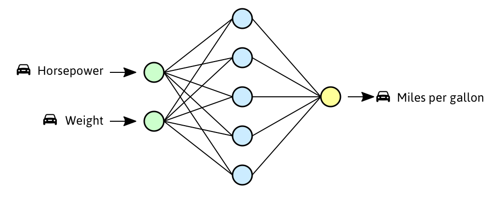
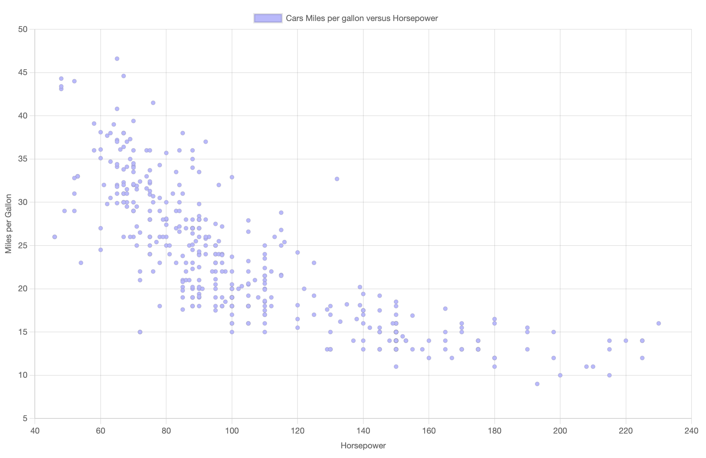

# Week 7

## Neural Networks - Regression



Een neural network is in staat om complexe patronen in data te vinden. In week 7 gaan we *getallen* voorspellen. Dit heet *regression*:
- **Classification** : het algoritme voorspelt een **categorie**, bv:
    - "kat", "hond" of "capibara"
    - "giftig" of "niet giftig"
    - "spam" of "geen spam"
    - "fraude" of "geen fraude"
- **Regression** : het algoritme voorspelt een **numerieke waarde**, bv: 
    - benzineverbruik van een auto
    - prijs van een huis
    - waarde van een tweedehands telefoon
    - percentage studenten die naar de les komen 😬

<br>
<br>
<br>

## Week 7 Lesopdracht

- Maak een scatterplot met demo data en met CSV data
- Train een Neural Network met CSV data
- Maak een voorspelling met een tekstveld
- Teken je voorspelling in het scatterplot

## Week 7 Inleveropdracht

- Train een neural network met een van de CSV files
- Gebruik train en testdata
- Train met meerdere kolommen 
- Sla je model op
- Laad het model in en maak een voorspelling

<br>
<br>
<br>
<br>
<br>
<br>

# Lesopdracht: scatterplot basics

> *De startcode en data bestanden vind je in de map [oefening](./oefening/)*

Teken een scatterplot voor ***horsepower versus mpg*** met deze demo data.

```javascript
const data = [
    { horsepower: 130, mpg: 18 },
    { horsepower: 165, mpg: 15 },
    { horsepower: 225, mpg: 14 },
    { horsepower: 97, mpg: 18 },
    { horsepower: 88, mpg: 27 },
    { horsepower: 193, mpg: 9 },
    { horsepower: 80, mpg: 25 },
]
```
Als je een scatterplot tekent, dan kan je alleen `x` en `y` waarden doorgeven. Hier zie je een code voorbeeld waarbij we de `map()` functie gebruiken om de `horsepower` en `mpg` om te zetten naar `x` en `y` waarden.

```javascript
import { createChart, updateChart } from "./scatterplot.js"

const chartdata = data.map(car => ({
    x: car.horsepower,
    y: car.mpg,
}))

// kijk hoe de data eruit ziet
console.log(chartdata)

// chartjs aanmaken
createChart(chartdata, "Horsepower", "MPG")
```
<br>
<br>
<br>

# Lesopdracht: scatterplot CSV data

Nu gaan we data uit een CSV file tekenen in de scatterplot. [Het inladen van CSV data doe je met Papa Parse](https://github.com/HR-CMGT/PRG08-2022-2023/blob/main/snippets/csv.md). Kijk of je CSV file een header heeft *(bv. "horsepower", "mpg", etc.)*. Als er een header is kan je dit aangeven bij het inladen van de CSV data.

```javascript
function loadData(){
    Papa.parse("./data/cars.csv", {
        download:true,
        header:true, 
        dynamicTyping:true,
        complete: results => checkData(results.data)
    })
}

function checkData(data) {
    console.table(data)
}
```

### Data is ingeladen

Met de `console.table()` functie kunnen we checken of het inladen van de CSV goed is gegaan. Je ziet dat deze data meerdere kolommen bevat: 

```
mpg,cylinders,displacement,horsepower,weight,acceleration,model year,origin,car name
```
### Scatterplot tekenen

Dit werkt hetzelfde als met de demo data. Echter, omdat er meerdere kolommen zijn, kan je zelf kiezen welke waarde je op de `x` en op de `y` as wil tekenen. Probeer om in plaats van `horsepower` een andere kolom in de `x-as` te tekenen *(bv. `weight`)*.
```javascript
const chartdata = data.map(car => ({
    x: car.horsepower,
    y: car.mpg,
}))
```
> *⚠️ Let op dat je de scatterplot niet kan tekenen voordat de data is ingeladen.*

### Data controleren

Nu je de CSV data in een scatterplot hebt getekend, kan je kijken of de data goed is:

- Trainingdata voor regression bestaat altijd uit getallen. Controleer dat alle waardes getallen zijn. Verwijder rijen met ongeldige waarden zoals "null", "", "undefined", etc. 
- Kijk of er vreemde data is, zoals een auto met een verbruik van 0 mpg of een horsepower van 20.000. 



<br>
<br>
<br>
<br>
<br>
<br>

# Lesopdracht: Neural Network

We gaan een Neural Network trainen met de `cars.csv` data. Het doel is dat we van een nieuwe auto kunnen voorspellen hoeveel `miles per gallon` de auto gaat gebruiken.

We maken een [ML5](https://learn.ml5js.org/#/reference/neural-network) neural network aan voor regression.

```javascript
const nn = ml5.neuralNetwork({ task: 'regression', debug: true })
```
> *⚠️ LET OP! Je kan het neural network pas aanmaken nadat de CSV data is geladen*

<br>

## Wat ga je voorspellen?

Door naar je CSV te kijken weten we dat we de `mpg` van de auto willen gaan voorspellen. Je kan kiezen welke kolom je daarvoor wil gebruiken, in dit geval gebruiken we `horsepower`. We maken een `for` loop om één voor één door elke rij van het CSV bestand te loopen.

```javascript
// shuffle
data.sort(() => (Math.random() - 0.5))

// een voor een de data toevoegen aan het neural network
for (let car of data) {
    nn.addData({ horsepower: car.horsepower }, { mpg: car.mpg })
}

// normalize
nn.normalizeData()
```
### Shuffle en Normalize

Deze twee functies zorgen dat het neural network beter in staat is om van de data te leren.

- shuffle: voorkomt dat het neural network de volgorde van de data leert. 
- normalize: voorkomt dat sommige kolommen belangrijker zijn dan andere.

>*Let op dat we de CSV data hier niet naar `x` en `y` vertalen, dat was alleen nodig voor het scatterplot.*

<br>
<br>
<br>

## Trainen

Bij het trainen moet je aangeven hoeveel `epochs` dit moet duren. Hier kan je zelf mee experimenteren. De blauwe lijn moet zo dicht mogelijk bij de waarde 0 komen. Als hier geen verbetering meer in zit, heb je genoeg epochs.

```javascript
function startTraining() {
    nn.train({ epochs: 10 }, () => finishedTraining()) 
}

async function finishedTraining(){
    console.log("Finished training!")
}
```


<br>
<br>
<br>

## Maak een voorspelling met een tekstveld

Met de `predict` functie kunnen we nieuwe data voorspellen! Maak een nieuwe `car` met een `horsepower` van `90`, waarvan we niet de `mpg` weten:

```javascript
async function makePrediction() {
    const results = await nn.predict({ horsepower: 90 })
    console.log(`Geschat verbruik: ${results[0].mpg}`)
}
```


Maak een inputveld en button in je HTML file waarmee de gebruiker een voorspelling kan doen voor een auto met een bepaalde `horsepower`. Let op dat je de waarde uit het invulveld moet omzetten naar een `number`. Toon vervolgens het resultaat in de `div` met de id `result`.

```html
<input type="text" id="field" placeholder="horsepower" />
<button id="btn">Voorspel!</button>
<div id="result"></div>
```

<br>
<br>
<br>


## Prediction tekenen als lijn


We maken een `for` loop voor elke mogelijke `horsepower` *(waarden van `40` tot `250`)*. Voor elke waarde doen we een voorspelling. Dit slaan we meteen op als `x` en `y` waarden, zodat we het in de scatterplot kunnen tekenen! 

Je kan de data toevoegen aan de bestaande scatterplot middels de `updateChart` functie.

```javascript
async function finishedTraining() {
    let predictions = []
    for (let hp = 40; hp < 250; hp += 2) {
        const pred = await nn.predict({horsepower: hp})
        predictions.push({x: hp, y: pred[0].mpg})
    }
    updateChart("Predictions", predictions)
}
```


<br>
<br>
<br>

# Volgorde in je code

De voorbeeldcode uit dit document moet je in de goede volgorde uitvoeren. Onderstaande drie acties kosten tijd *(de acties zijn asynchroon)*, wat betekent dat je moet wachten tot het klaar is, voordat je verder kan.

- laden van een CSV
- trainen van een neural network
- doen van een voorspelling

We gebruiken `callback` functies en `async await` om te wachten totdat een voorgaande functie klaar is. We maken `nn` een globale variabele, zodat we deze in alle functies kunnen gebruiken.

```javascript
let nn

function loadData(){
    Papa.parse("...", {
        ...
        complete: results => checkData(...)             // callback
    })
}

function checkData(...) {
    ...
    nn.train({ epochs: 10 }, () => finishedTraining())  // callback
}

async function finishedTraining(){
    let result = await nn.predict(...)                  // async await
    console.log(result)
}
```

<br>
<br>
<br>

# Trainen met arrays

In al deze voorbeelden trainen we met objecten. Je kan een ML5 Neural Network ook trainen met arrays. Let op dat als je dit doet, dat je `predict()` ook met een array moet doen.

```javascript
nn.addData([car.horsepower, car.battery, car.weight], [car.mpg])
nn.predict([90, 1000, 2000])
```

<br>
<br>
<br>

# Inleveropdracht

Bij de praktijkopdracht van week 7 ga je een neural network trainen met een CSV dataset uit deze repository. Ook ga je het model **opslaan**, zodat je niet telkens opnieuw hoeft te trainen.

[Ga naar de inleveropdracht](./inleveropdracht.md)

<br>
<br>
<br>

## Documentatie

- [🔥 ML5 Neural Networks in Javascript](https://learn.ml5js.org/#/reference/neural-network)
- [ChartJS Scatterplot code voorbeeld](https://github.com/HR-CMGT/PRG08-2021-2022/blob/main/snippets/scatterplot.md)
- [ChartJS Scatterplot documentatie](https://www.chartjs.org/docs/latest/charts/scatter.html)

## Externe links

- [📺 Crash Course Neural Networks](https://www.youtube.com/watch?v=JBlm4wnjNMY)
- [📺  But what is a neural network?](https://www.youtube.com/watch?v=aircAruvnKk)
