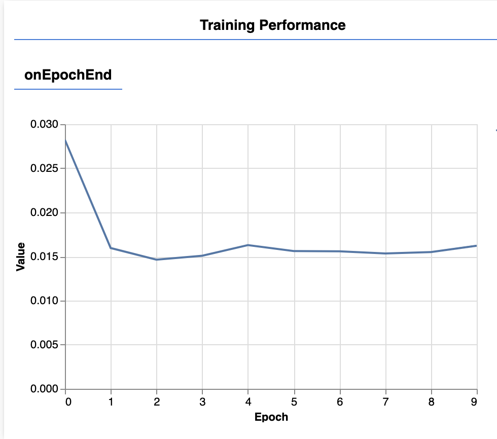

# Inleveropdracht week 7

Zorg dat je de [lesopdracht](./README.md) hebt afgerond. Hierin train je een neural network met de "cars" dataset, en je leert een scatterplot te tekenen. Ook vind je een uitleg over het werken met objecten en arrays, en over de juiste volgorde in je code.

## Stappen

- Kies een CSV file uit de data map. Je mag ook zelf een CSV file zoeken die geschikt is voor regression (voorspellen van een waarde).
- Train het neural network met meerdere kolommen. Bepaal hoeveel epochs en welke kolommen je nodig hebt. 
- Sla het model op.
- Laad het model in een nieuwe html pagina, waarin je via een UI een voorspelling kan doen.
- Plaats je eindresultaat live online, bv. op github pages. Plaats je broncode op github. Vervolgens vul je in feedbackfruits de evaluatie in.

<br>
<br>
<br>

# CSV data

Maak een `train.html` webpagina en een `train.js` script. Laad hierin een dataset met [Papa Parse](https://github.com/HR-CMGT/PRG08-2022-2023/blob/main/snippets/csv.md):

- Mobile Phone prijzen bepalen aan de hand van de specs van een telefoon
- Utrechtse huizenprijs bepalen aan de hand van ligging en eigenschappen van een huis
- Wijn kwaliteit bepalen aan de hand van de chemische samenstelling van de wijn
- Zoek zelf een regression dataset op [Kaggle](https://www.kaggle.com/search?q=tag%3A%22regression%22+in%3Adatasets) of [UCI](https://archive.ics.uci.edu/ml/datasets.php?format=&task=reg&att=&area=&numAtt=&numIns=&type=&sort=nameUp&view=table)

## Data voorbereiden

Bekijk de geladen CSV data via `console.table(data)` om te zien of het inladen goed is gegaan.

Verwijder rijen met ongeldige waarden zoals "null", "NaN", "", "undefined", etc. 

Het is handig als je *kolomnamen* geen spaties of vreemde tekens bevatten. Vervang bijvoorbeeld "RAM (GB)" door "ramGb".

Controleer welke kolommen getallen bevatten. Deze kan je gebruiken om te trainen. Je kan twee kolommen in een scatterplot tekenen om te zien of die data nuttig is. Bv een "ID" zegt niets over de waarde van een telefoon.

Een kolom met tekst kan wel belangrijk zijn, bv. het merk van een telefoon. Je kan teksten via ***find + replace*** vervangen door nummers, bijvoorbeeld:

```html
APPLE = 1
SAMSUNG = 2
XIAOMI = 3
etc.
```

Je kan je CSV data het beste editen in Excel, Google Sheets of Numbers. Kies vervolgens voor `exporteren als CSV` om het bestand op te slaan.

<br>
<br>
<br>

# Trainen met meerdere kolommen

In de les hebben we `horsepower` gebruikt om de `mpg` te leren. Nu gaan we meerdere kolommen gebruiken om te trainen. Voordat we gaan trainen is het handig om je data op te splitsen in ***train en testdata***.

```javascript
function checkData(data){
    // data voorbereiden
    data.sort(() => (Math.random() - 0.5))
    let trainData = data.slice(0, Math.floor(data.length * 0.8))
    let testData = data.slice(Math.floor(data.length * 0.8) + 1)

    // neural network aanmaken
    nn = ml5.neuralNetwork({ task: 'regression', debug: true })

    // data toevoegen aan neural network
    for(let car of trainData){
        nn.addData({ horsepower: car.horsepower, weight: car.weight, cylinders:car.cylinders }, { mpg: car.mpg })
    }
}
```
## Trainen

Bepaal hoeveel epochs je nodig hebt. De blauwe lijn moet zo dicht mogelijk bij nul komen.

```javascript
nn.train({ epochs: 10 }, () => finishedTraining()) 
```



<br>
<br>
<br>

## Voorspelling doen met de testdata

Om te kijken of het trainen goed is gegaan doe je een voorspelling met testdata. Let op dat je hierbij dezelfde kolommen gebruikt als bij het trainen.

```javascript
async function makePrediction() {
    const testCar = { horsepower: testData[0].horsepower, weight: testData[0].weight, cylinders:testData[0].cylinders }
    const pred = await nn.predict(testCar)
    console.log(pred[0].mpg)
}
```

> *Je kan voorspellingen van je testdata aan je scatterplot toevoegen door een `x` en `y` as te kiezen, bijvoorbeeld `x = horsepower` en `y = mpg`.*

<br>
<br>
<br>

## Model opslaan

Het is niet handig dat je steeds moet trainen voordat je een voorspelling kan doen. Daarom gaan we [het getrainde model opslaan](https://learn.ml5js.org/#/reference/neural-network?id=save). Voeg een `<button>` toe aan je "training" webpagina waarmee je je getrainde model kan opslaan. 

```javascript
nn.save()
```
⚠️ Als je na het trainen op de knop klikt worden er drie bestanden gedownload:
```bash
model_meta.json
model.json
model.weights.bin
```
### Structuur

Voor deze oefening is het overzichtelijk om een dergelijke bestandstructuur aan te houden:

```javascript
train.html
train.js
predict.html
predict.js
model
    model_meta.json
    model.json
    model.weights.bin
data
    cars.csv
```
<br>
<br>
<br>

## Model inladen

Maak nu een nieuwe webpagina waarin je dit [getrainde model gaat inladen](https://learn.ml5js.org/#/reference/neural-network?id=load). In deze pagina hoef je géén CSV data te laden en je hoeft geen neural network te trainen. 

```javascript
nn = ml5.neuralNetwork({ task: 'regression', debug: true })
nn.load('./model/model.json', modelLoaded)
```

### Troubleshooting

- Je moet het model laden via `http://` of `https://`. Test je site dus via *localhost* of via een *online server*.
- Het geven van een eigen bestandsnaam aan het model gaat niet altijd goed. Gebruik daarom `nn.save()` in plaats van `nn.save("mymodel")`.

### Invoervelden

Maak een *gebruiksvriendelijke UI* waarin de gebruiker gegevens kan invoeren, en waarin de voorspelling getoond wordt.

```html
    <input type="text" id="horsepower" placeholder="horsepower" />
    <input type="text" id="weight" placeholder="weight" />
    <input type="text" id="cylinders" placeholder="cylinders " />
    <button id="btn">Voorspel het verbruik!</button>
    <div id="result"></div>
```

<br>
<Br>
<br>

## Prijzen weergeven

Om getallen als prijs te tonen kan je de volgende functie gebruiken:

```javascript
const housevalue = 2324344.4384992001
const fmt = new Intl.NumberFormat('nl-NL', { style: 'currency', currency: 'EUR' })
console.log(fmt.format(housevalue))
```

<br>
<br>
<br>

# Links

## Datasets voor regression

- [UCI regression dataset search](https://archive-beta.ics.uci.edu/datasets?Task=Regression&sort=desc&orderBy=NumHits&skip=0&take=10)
- [Kaggle regression dataset search](https://www.kaggle.com/search?q=tag%3A%22regression%22+in%3Adatasets)
  

## Documentatie

- [Opschonen van CSV data met filter en map](https://github.com/HR-CMGT/PRG08-2020-2021/blob/main/snippets/csv.md).
- [ML5 Neural Network](https://learn.ml5js.org/#/reference/neural-network)
- [ML5 Model Opslaan](https://learn.ml5js.org/#/reference/neural-network?id=save) en [Laden](https://learn.ml5js.org/#/reference/neural-network?id=load)
- [ChartJS Scatterplot code voorbeeld](https://github.com/HR-CMGT/PRG08-2021-2022/blob/main/snippets/scatterplot.md)
- [ChartJS Scatterplot documentatie](https://www.chartjs.org/docs/latest/charts/scatter.html)

## Wat is een Neural Network?

- [📺 Crash Course Neural Networks](https://www.youtube.com/watch?v=JBlm4wnjNMY)
- [📺  But what is a neural network?](https://www.youtube.com/watch?v=aircAruvnKk)
- [Neural Network Playground](https://playground.tensorflow.org/)
- [Towards Data Science : Neural Networks for beginners](https://towardsdatascience.com/a-beginners-guide-to-neural-networks-d5cf7e369a13)

## Bonus

- [Scatterplot in 3D](https://plotly.com/javascript/3d-scatter-plots/) en [Codepen Voorbeeld](https://codepen.io/pen?&prefill_data_id=47954577-5937-4f60-a3b6-25b32983585f)
- [Hidden Layers toevoegen aan je Neural Network](https://github.com/HR-CMGT/PRG08-2021-2022/blob/main/snippets/layers.md)