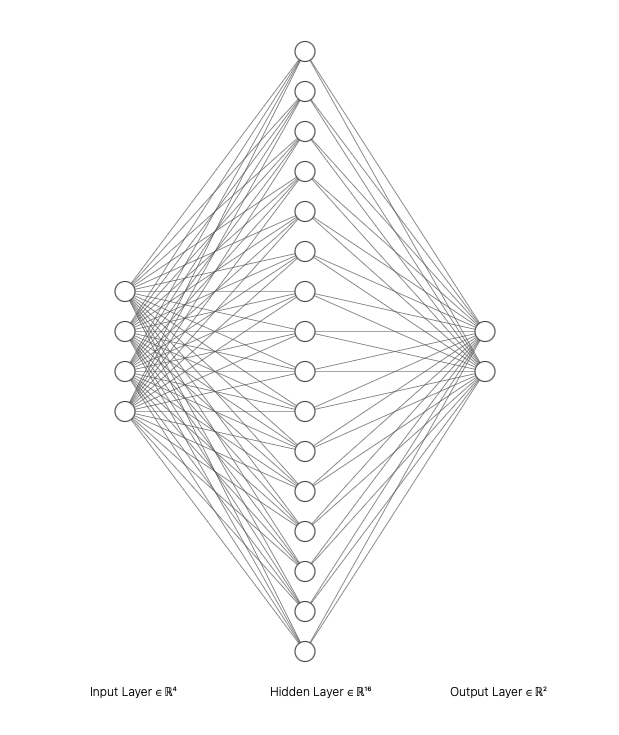

# Week 8

## Neural Networks Classification

In deze oefening kijken we naar `classification` met een ML5 Neural Network. Dat betekent dat we een ***categorie*** gaan voorspellen. 

1. Test de voorbeeldcode met de `weather.csv` data om te voorspellen of het morgen gaat regenen (Ja/Nee). Voeg kolommen toe om de nauwkeurigheid te verbeteren.
2. Gebruik `traindata` en `testdata` om de nauwkeurigheid te berekenen, [zie hiervoor ook week 6](../week6/README.md).
3. Voeg twee hidden layers toe om te zien of de nauwkeurigheid toeneemt. Het kan zijn dat dit niet zo is!
4. Kies vervolgens zelf een ***ander CSV bestand*** om een classification mee te doen:
    - Gaat deze HR student de studie afronden? (Ja/Nee)
    - Krijgt deze persoon in de komende 10 jaar hartproblemen? (Ja/Nee)
    - Gaat deze klant binnen de komende maand hun abonnement opzeggen? (Ja/Nee)
    - Of kies een andere dataset die geschikt is voor classification.

<br>
<br>
<br>

## Data bekijken

Laad een [classification CSV file](./oefening/data) op dezelfde manier als in [week 7](../week7/README.md). Toon de data via `console.table(data)`. 

In dit voorbeeld trainen we op `MinTemp` en `MaxTemp` en voorspellen we `RainTomorrow`. *⚠️ De voorspelling moet altijd een string zijn ("Yes" of "No").*

***Voeg meer kolommen uit de CSV toe om je model beter te maken!***

We gebruiken hier `filter()` om zeker te weten dat `MinTemp` en `MaxTemp` een getal zijn. De kans dat een CSV file een foutje bevat is helaas best groot!

```javascript
const cleanData = data
    .map(day => ({
        MinTemp: day.MinTemp,
        MaxTemp: day.MaxTemp,
        RainTomorrow: day.RainTomorrow
    }))
    .filter(day => 
        typeof day.MinTemp === "number" &&
        typeof day.MaxTemp === "number"
    )
```
Als je data goed is *shufflen* we de data en splitsen we de data in *train-* en *testdata*, net zoals in de oefening over regression.

```javascript
cleanData.sort(() => (Math.random() - 0.5))
let trainData = cleanData.slice(0, Math.floor(data.length * 0.8))
let testData = cleanData.slice(Math.floor(data.length * 0.8) + 1)
```

<br>
<br>
<br>


# Neural Network

De `trainData` splitsen we hier op in de `inputs` (de data die herkend moet gaan worden) en `output` (het resultaat dat we terug verwachten). Je kan experimenteren of meer ***epochs*** resulteren in een beter model.

```javascript
function trainNeuralNetwork(trainData) {
    const nn = ml5.neuralNetwork({ task: 'classification', debug: true })

    for (let day of trainData) {
        const inputs = {
            MinTemp: day.MinTemp,
            MaxTemp: day.MaxTemp
        }
        const output = { RainTomorrow: day.RainTomorrow } 
        nn.addData(inputs, output)
    }

    nn.normalizeData()
    nn.train({ epochs: 32 }, () => finishedTraining())
}
```

> *Als het trainen niet lijkt te werken, of je voorspelling is altijd hetzelfde, dan is er waarschijnlijk iets mis met je data.*

<br>
<br>
<br>

## Classification

Als het trainen klaar is kan je een voorspelling doen voor het weer van morgen. Je kan dit doen met zelf ingevoerde data of met de `testData`. 

```javascript
async function finishedTraining() {
    const fakeDay = { MinTemp: -3, MaxTemp: 4 }
    const testDay = { MinTemp: testData[0].MinTemp, MaxTemp: testData[0].MaxTemp }
    
    const result = await nn.classify(fakeDay)
    console.log(`Rain Tomorrow: ${result[0].label} - Confidence ${(result[0].confidence * 100).toFixed(2)}%`)
}
```

<br>
<br>
<br>

## Accuracy berekenen met testdata

Als je een voorspelling doet met de `testData` kan je de voorspelling vergelijken met de daadwerkelijke `RainTomorrow` waarde. Op die manier weten we of de voorspelling klopt! Als we dit in een `for` loop doen kunnen we bijhouden hoeveel van de gemaakte voorspellingen overeen komen met de werkelijke waarde. [Zie ook de lesstof van week 6](../week6/README.md).

```javascript
async function getAccuracy() {
    let correctPredictions = 0

    for (let day of testData) {
        const inputs = { MinTemp: day.MinTemp, MaxTemp: day.MaxTemp }
        const result = await nn.classify(inputs)
        console.log(`Predicted: ${result[0].label}, Actual data: ${day.RainTomorrow}`)
        if (result[0].label === day.RainTomorrow) correctPredictions++
    }

    console.log(`Correcte voorspellingen ${correctPredictions} van de ${testData.length}, dit is ${((correctPredictions / testData.length) * 100).toFixed(2)} %`)
}
```

<br>
<br>
<br>

## Hidden layers toevoegen

In de [Neural Network Playground](https://playground.tensorflow.org/) hebben we gezien dat je zelf een neural network kan opbouwen uit layers en neurons.



In ML5 kan je dit doen via het `options` object. In dit voorbeeld voegen we ***twee hidden layers met 32 neurons*** toe. Experimenteer hier zelf mee. Check of de accuracy beter wordt. *Het kan goed zijn dat dit niet het geval is!* Ook kan het zijn dat je meer epochs nodig hebt. 

Het aantal benodigde layers hangt samen met de complexiteit van je data. Voor simpele data heb je geen extra layers nodig.

```javascript
const options = { 
    task: 'classification', 
    debug: true,
    layers: [
        {
            type: 'dense',
            units: 32,
            activation: 'relu',
        }, {
            type: 'dense',
            units: 32,
            activation: 'relu',
        }, 
        {
            type: 'dense',
            activation: 'softmax',
        },
    ]
}
nn = ml5.neuralNetwork(options)
```
> *⚠️ De laatste layer (de `softmax` layer) moet je niet aanpassen. Deze layer bepaalt of we een classification of regression doen.*

[Zie ook de code snippet voor hidden layers](https://github.com/HR-CMGT/PRG08-2022-2023/blob/main/snippets/layers.md)

<br>
<br>
<br>

## Model opslaan

Als je tevreden bent met de accuracy, dan kan je model opslaan met `nn.save()`. Je kan ook een aantal keer trainen en alleen de beste accuracy opslaan. [Zie hiervoor ook week 7](../week7/README.md)

<br>
<br>
<br>

## Datasets voor classification
  
- [Weather](./oefening/data/weather.csv)
- [Student Dropout](./oefening/data/student-dropout.csv)
- [Customer Churn (opzeggen abonnement voorspellen)](./oefening/data/customer-churn.csv)
- [Hartproblemen in de komende 10 jaar voorspellen](./oefening/data/heart-disease.csv)
- [Diabetes](https://github.com/HR-CMGT/PRG08-2021-2022/blob/main/week5/oefening/data/diabetes.csv)
- [Poisonous Mushrooms](https://github.com/HR-CMGT/PRG08-2021-2022/blob/main/week5/oefening/data/mushrooms.csv)
- [Titanic Survivors](https://github.com/HR-CMGT/PRG08-2021-2022/blob/main/week5/oefening/data/titanic.csv)
- [💔 Divorce prediction](https://www.kaggle.com/datasets/andrewmvd/divorce-prediction)
- [❤️ Speed Dating - who gets the most dates?](https://www.kaggle.com/datasets/annavictoria/speed-dating-experiment)
- [⚽️ Voetbal uitslagen voorspellen](https://www.kaggle.com/datasets/hugomathien/soccer)

## Documentatie

- [Prepareren van data met map en filter](https://github.com/HR-CMGT/PRG08-2020-2021/blob/main/snippets/csv.md).
- [ML5 Neural Networks in Javascript](https://learn.ml5js.org/#/reference/neural-network)
- [Werken met hidden layers in ML5](./snippets/layers.md)
