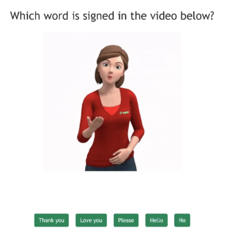

# Week 9 eindopdracht

## Concept

- Beschrijf kort het idee voor jouw applicatie
- Wat is de toegevoegde waarde van AI in jouw concept? 
- Welke data heb je nodig en hoe kom je daar aan?
- Welke library / algoritme denk jij dat geschikt is voor jouw concept?
- Werk je met classification of regression?
- Beschrijf de de uiteindelijke vorm (Website, app, installatie, etc).
- Beschrijf kort de eindgebruiker en de doelgroep.

## Prototype

Om te testen of jouw AI idee haalbaar is bouw je een werkend code prototype. Het prototype gebruikt een van de algoritmes uit les 4 t/m 8. Het prototype is getraind met jouw data.

- ML5 pose / hand / face detection waarbij je specifieke poses kan herkennen, door de data te combineren met KNN of een Neural Network.
- KNN classifier met eigen data of data van Kaggle.
- Decision Tree classifier met eigen data of data van Kaggle.
- ML5 Neural Network classification of regression met eigen data of data van Kaggle
- Andere toepassing van een algoritme en data in overleg met docent

## Uitwerking

- Je hebt een gebruiksvriendelijke interface gebouwd met een professionele uitstraling.
- Er vindt geen training plaats in de uitwerking. Je gebruikt het model dat je zelf vantevoren hebt getraind in het prototype. 
De uitwerking doet een voorspelling naar aanleiding van gebruikersinput. 

## Beoordeling 

Zie cursushandleiding

## Data

Je kan zelf data verzamelen of gebruik maken van data van Kaggle. Hieronder vind je een aantal voorbeeld datasets. 

- [Customer Churn Telecom](https://www.kaggle.com/datasets/blastchar/telco-customer-churn)
- [Prices of second hand mobile phones](https://www.kaggle.com/datasets/pratikgarai/mobile-phone-specifications-and-prices)
- [mcDonalds Nutrition](https://www.kaggle.com/mcdonalds/nutrition-facts)
- [Bigfoot sightings](https://data.world/timothyrenner/bfro-sightings-data)
- [UFO sightings](https://www.kaggle.com/NUFORC/ufo-sightings)
- [Speed Dating](https://www.kaggle.com/datasets/annavictoria/speed-dating-experiment)
- [Marriage and Divorce](https://www.kaggle.com/aagghh/divorcemarriage-dataset-with-birth-dates)
- [Football results](https://www.kaggle.com/martj42/international-football-results-from-1872-to-2017)
- [Amazon reviews](https://cseweb.ucsd.edu/~jmcauley/datasets.html#amazon_reviews)
- [Cats in movies](https://test-customers-ca.opendatasoft.com/explore/dataset/cats-in-movies/table/)
- [Spam detection](https://www.kaggle.com/datasets/veleon/ham-and-spam-dataset)
- [Meaning of cat meows](https://zenodo.org/record/4008297#.YjidJy8w1pR)
- [Kaggle search classification](https://www.kaggle.com/datasets?search=classification) en [Kaggle search regression](https://www.kaggle.com/datasets?search=regression)
- [Nog meer datasets in de reading list](https://github.com/HR-CMGT/Javascript-Machine-Learning#datasets)

 
 
 

## Voorbeelden

 
[Penalty prediction](https://cmgt.hr.nl/projecten/penalteam)  

 
[Sign Language Learning](https://cmgt.hr.nl/projecten/SignLearn)